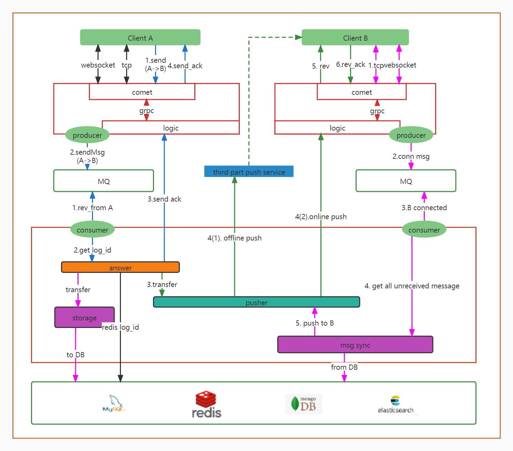

# 即时通讯系统业务层

dtalk是即时通讯系统的业务处理服务，主要负责消息的过滤、存储、同步等



## 开始

### 从源码编译

环境要求:
1. Golang 1.17 or later, 参考[golang官方安装文档](https://go.dev/doc/install)

```shell
# 编译本机系统和指令集的可执行文件
$ make build

# 编译目标机器的可执行文件,例如
$ make build_linux_amd64
```
编译成功后目标执行文件在工程目录的target文件夹下。

运行服务命令：
```shell
# <serviceName>表示具体要运行的服务名称
$ ./target/<serviceName> -f ./target/<serviceName>.toml
```

### docker容器中运行

环境要求:
1. Golang 1.17 or later, 参考[golang官方安装文档](https://go.dev/doc/install)
2. docker engine version 20.10.17 or later, 安装参考[docker官方安装文档](https://docs.docker.com/get-docker/)

```shell
# 初始化docker环境
$ make init-compose

# 打包镜像及运行容器
$ make docker-compose-up

# 查看容器是否运行成功
$ make docker-compose-ps
```

## 使用工具验证

使用im-util仓库下的[pressure](https://github.com/txchat/im-util/tree/master/pressure )工具测试服务是否成功部署。

查看默认端口是否开放：
```shell
# 服务器ip或域名
$ telnet <ip>:8888
```

执行pressure命令行工具：
```shell
# <ip>为comet服务ip地址
$ ./pressure pre -s "<ip>:3102" -u 2 -t 5s
```
等待命令执行成功后会在可执行文件目录下生成pressure_output.txt文件，再执行：
```shell
$ ./pressure ana

# 控制台打印出如下内容表示发送的消息全都成功 failed count: 0
{"level":"info","time":"2022-07-26T11:10:27.879292+08:00","message":"message tranport success count: 10 -- failed count: 0"}
```

### License

dtalk is under the MIT license. See the [LICENSE](LICENSE) file for details.
